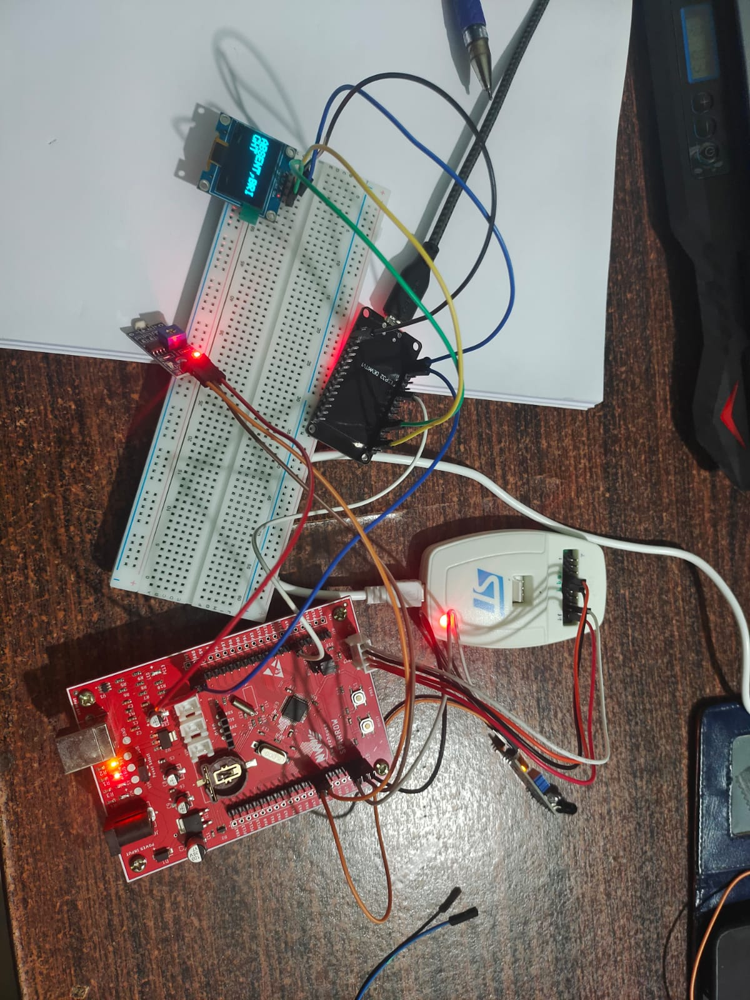

STM32-ESP32 Smart Presence & Lighting Monitor

Project Overview

This project combines an IR sensor and an LDR sensor with STM32 and ESP32.

The STM32 reads presence and ambient light conditions and sends the information to the ESP32 through UART communication.

The ESP32 receives the data and displays the status on an SSD1306 OLED display.

Features

- Presence detection using IR sensor
- Light detection using LDR sensor
- STM32 UART transmission
- ESP32 UART reception
- OLED status display
- Real-time monitoring

Hardware Used

- STM32 Sparrow Board
- ESP32 DevKit V1
- IR Obstacle Sensor
- LDR Sensor Module
- SSD1306 OLED Display
- Jumper Wires

Communication Flow

IR Sensor + LDR Sensor
↓
STM32
↓ UART
ESP32
↓ I2C
OLED Display

Wiring

IR Sensor

VCC → STM32 3V3

GND → STM32 GND

OUT → STM32 PB0

LDR Sensor

VCC → STM32 3V3

GND → STM32 GND

DO → STM32 PB1

STM32 to ESP32 UART

STM32 PA9 (TX) → ESP32 GPIO16 (RX2)

STM32 GND → ESP32 GND

OLED to ESP32

OLED VCC → ESP32 3V3

OLED GND → ESP32 GND

OLED SDA → ESP32 GPIO21

OLED SCL → ESP32 GPIO22

Sample Outputs

ABSENT,DARK

ABSENT,BRIGHT

PRESENT,DARK

PRESENT,BRIGHT

Skills Demonstrated

- Embedded C
- STM32CubeIDE
- HAL Drivers
- UART Communication
- GPIO Input Handling
- I2C Communication
- OLED Display Interfacing
- Multi-Microcontroller Communication

Images

Hardware Setup

STM32 Configuration

